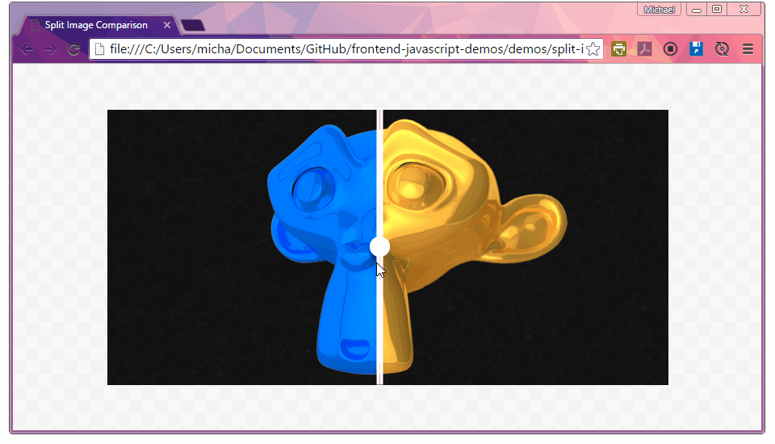
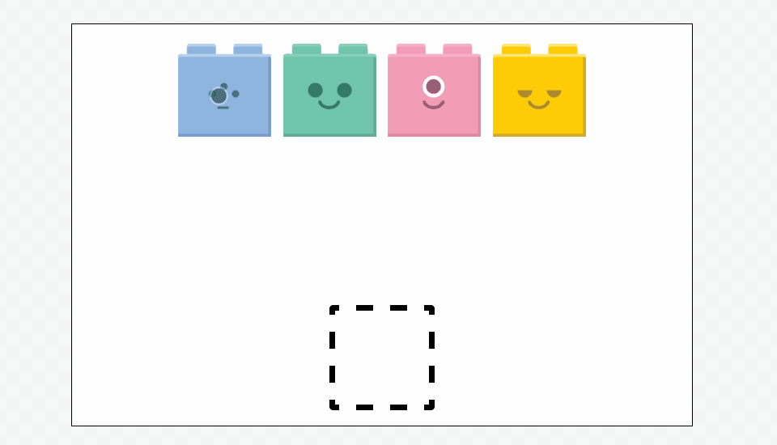

frontend-javascript-demos
=========================

A collection of frontend javascript teaching demos

split-image
-----------

basic: [code](https://github.com/mikewesthad/frontend-javascript-demos/tree/gh-pages/demos/split-image/split-image-basic); [live demo](http://www.mikewesthad.com/frontend-javascript-demos/demos/split-image/split-image-basic/)

advanced: [code](https://github.com/mikewesthad/frontend-javascript-demos/tree/gh-pages/demos/split-image/split-image-advanced); [live demo](http://www.mikewesthad.com/frontend-javascript-demos/demos/split-image/split-image-advanced/)

drag-and-drop
-------------

basic: [code](https://github.com/mikewesthad/frontend-javascript-demos/tree/gh-pages/demos/drag-and-drop/drag-and-drop-basic); [live demo](http://www.mikewesthad.com/frontend-javascript-demos/demos/drag-and-drop/drag-and-drop-basic)

advanced: [code](https://github.com/mikewesthad/frontend-javascript-demos/tree/gh-pages/demos/drag-and-drop/drag-and-drop-advanced); [live demo](http://www.mikewesthad.com/frontend-javascript-demos/demos/drag-and-drop/drag-and-drop-advanced)
